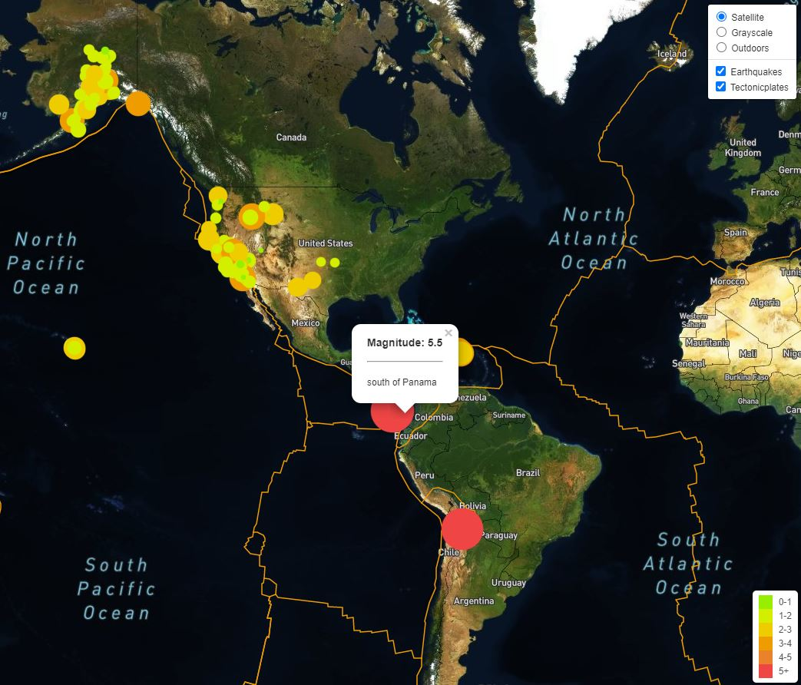

# Earthquakes Map with Leaflet
Leaflet project for Monash Data Analytics Boot Camp

The purpose of this project was to build a map that dynamically displays the current earthquake data from the United States Geological Survey website.

# Data

There are two key sources of data used:

* [USGS GeoJSON Feed](http://earthquake.usgs.gov/earthquakes/feed/v1.0/geojson.php) - JSON representation of earthquake data from USGS, updated every 5 minutes

* [tectonicplates](https://github.com/fraxen/tectonicplates) - JSON file with data on tectonic plates

# Analysis

## Leaflet Step 1

* Create a map using Leaflet that plots all of the earthquakes from the data set based on their longitude and latitude:

  * Data markers reflect the magnitude of the earthquake in their size and color

  * Data markers include popups that provide additional information about the earthquake when a marker is clicked

  * Map has a legend that provides context for markers colors

## Leaflet Step 2

* Add extra data to the map:

  * Base layer with satellite view

  * Base layer with outdoors view

  * Overlay with earthquake data

  * Overlay with tectonic plates data

  * Add layer controls to the map so that user can choose base maps and overlays can be turned on and off independently

## extras

### heatmap

* Create a map using Leaflet that plots all of the earthquakes from the data set as a heatmap:

### markers-cluster

* Create a map using Leaflet that plots all of the earthquakes from the data set as a markers clusters:

### timeline

* Add [timeline](https://github.com/socib/Leaflet.TimeDimension) to the map from Step 2 which dynamically displays the earthquakes per timestamp:

# Demo

To run the examples locally save the repo, navigate into the selected folder, run `python -m http.server` in command line and visit http://localhost:8000/ in your browser.

NOTE: This application requires `config.js` file with your `API_KEY` for mapbox API.

# Used Tools
 * JavaScript
 * D3
 * Leaflet
 * HTML
 * CSS

#

#### Contact: mil.haszek@gmail.com

